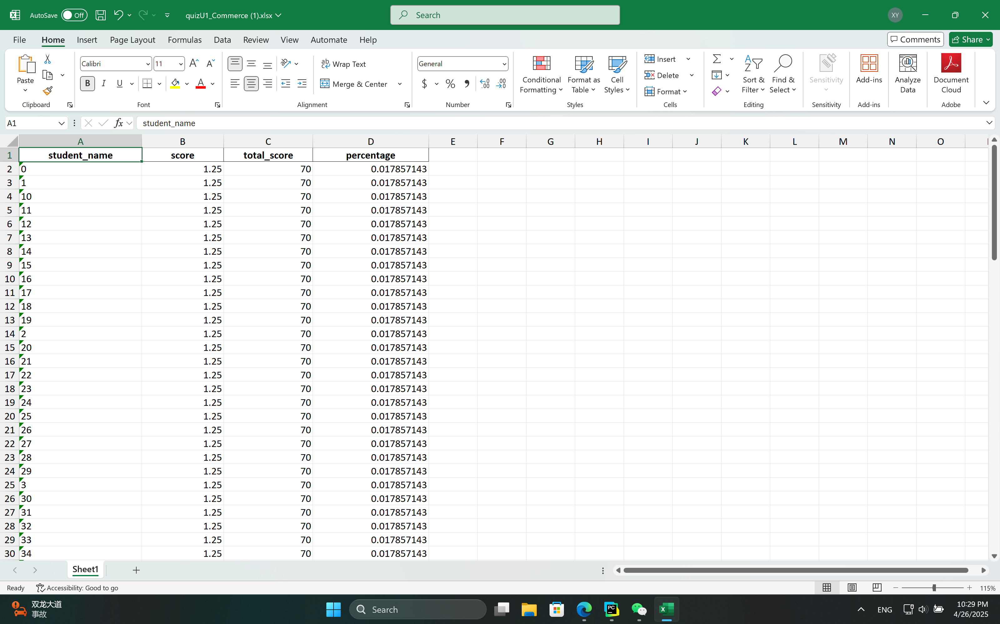

# PQuiz

Quickly create online quizzes with PQuiz.

## Table of Contents

1. [Features](#features)
2. [Installation](#installation)
3. [Usage](#usage)
4. [Configuration](#configuration)

## Features

### For Students

- **User Authentication**: Login with your class and name.
- **Quiz Participation**: Take various quizzes.
- **Quiz Review**: Review completed quizzes.

### For Teachers/Admin

- **Quiz Management**: Create, edit, and verify quizzes using JSON files.
- **Performance Tracking**: View detailed results for each student.
- **Data Analysis**: Download statistics in Excel format.

## Installation

Follow these step-by-step instructions to set up the project locally:

```bash
# Clone the repository
git clone https://github.com/PelerYuan/PQuiz

# Navigate into the project directory
cd PQuiz

# Create a configure file tmp
vim configure.json

# The configure file should be like this:
{
  "admin password": {
    "High School Affiliated to Nanjing Normal University": "password here",
    "Test school": "password here"
  }
}

# using docker-compose to build up
docker-compose up
```

## Usage

### For Students

1. **Login**: Use your class and name to log in.
   

2. **Homepage**: View all available quizzes.
   

3. **Take a Quiz**: Select and attempt a quiz.
   

4. **Review Quizzes**: Check your quiz results.
   

### For Teachers/Admin

1. **Admin Login**: visit `website/admin`
   

2. **Quiz Management**: Manage all quizzes from the admin dashboard.
   

3. **Edit JSON Files**: Modify quiz content as needed.
   

4. **View Results**: Access individual student performance data.
   

5. **Download Statistics**: Export quiz data in Excel format.
   

## Configuration

## Configuration

1. **Create Quizzes**: Use the provided JSON format. Refer to the [example](doc/quiz_example.json).

2. **Place Quiz Files**: Store quiz configuration files in the `data/quizs` directory, e.g.:

```
./data/quizs/
├── quizU1.json
└── quizU2.json
```


3. **Organize Classes**: Create folders under `data/students` for different classes, e.g.:

```
./data/students/
├── Commerce
├── Design
├── Science1
├── Science2
└── admin
```